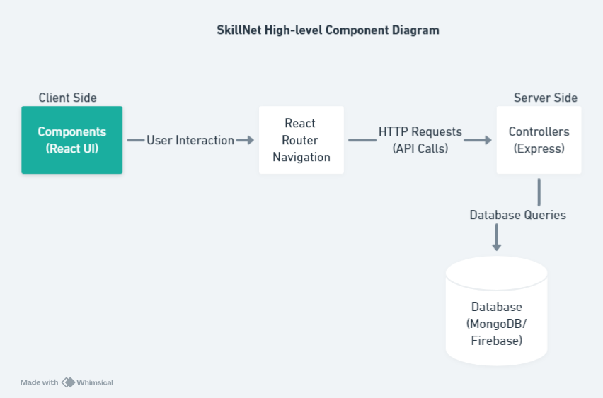

## High-level Diagram

The high-level diagram provides an overview of the architecture of the SkillNet application, depicting the flow of data and interactions between different components.

- Client Side: Represented by the React UI. Here user interactions occur through various views. These views are responsible for rendering the user interface elements using React components.

- React Router: Handles client-side routing and navigation within the application. This ensures that the appropriate view is displayed based on user actions such as clicking on links or typing in URLs.

- Server Side: The server-side components implemented using Express.js. This includes controllers responsible for handling HTTP requests and responses. Express.js facilitates the creation of RESTful APIs, allowing communication between the client-side and server-side components.

- Database: Represents the backend database, implemented using MongoDB or Firebase. It stores and manages application data, including user profiles, skills, and messages. The server-side components interact with the database through database queries to retrieve or manipulate data as required by client requests.

Overall, this architecture enables SkillNet to provide a seamless user experience by efficiently managing client-server communication, routing, and data storage.

## Entity Relationship Diagram

The entity diagram displays the structure of the database schema for the SkillNet application.

- User: Represents the user profile with attributes such as unique_id (ObjectId), firstName, lastName, email, password, and an array of skills. Each user has a unique identifier, and they can have multiple skills associated with them.

- Skill: Represents a skill possessed by a user. It contains attributes such as unique_id (ObjectId), name, and a reference to the user who owns the skill through the user_id field. Each skill is uniquely identified, and it is associated with one user.

- Message: Represents a message exchanged between users. It includes attributes such as unique_id (ObjectId), sender_id, receiver_id, content, and timestamp. Each message has a unique identifier and is associated with one sender and one receiver.

This schema enables the SkillNet application to store user profiles, their associated skills, and facilitate communication between users through messages.

## Call Sequence Diagram

In this call sequence diagram:

- User A sends a swap request to User B.
- SkillNet App receives the swap request and processes it.
- SkillNet App notifies User B about the swap request.
- User B accepts the swap request.
- SkillNet App sends a message to User A to initiate the conversation.
- User A checks for new messages.
- SkillNet App retrieves any new messages for User A.
- User A receives the new messages.
- User A views the message from User B.
This sequence illustrates the flow of actions and communication between the users and the SkillNet application when sending a message after a swap request is accepted.