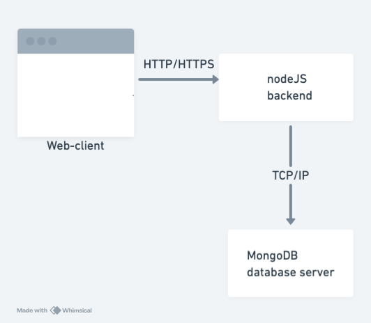
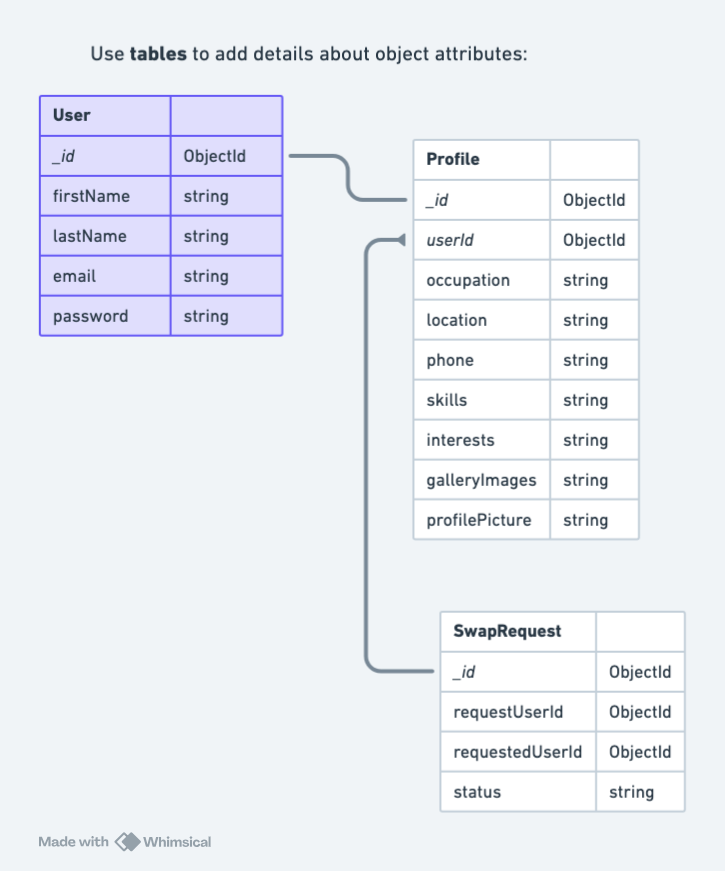
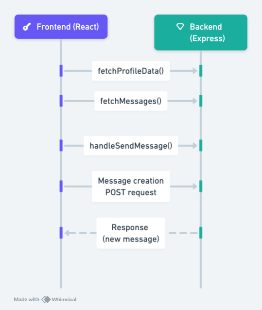

# SkillNet Architecture HW 2

## Question 1 

This diagram shows the architecture of the SkillNet webapp that uses ReactJS for the frontend, Node.js for the backend, and MongoDB for the database. The ReactJS Frontend consists of various components, including a header, footer, and main component. The frontend interacts with the backend server via HTTP/HTTPS requests in JSON format. These requests are handled by the Node.js Backend, which consists of API controllers, a service layer, and database models. The API controllers manage specific routes such as /api/users and /api/messages, delegating tasks to the service layer that contains the business logic. The service layer interacts with the MongoDB Database over TCP/IP.

## Question 2 

The entity diagram outlines three entities: User, Profile, and SwapRequest. Each User is uniquely identified by an ObjectId and contains attributes such as firstName, lastName, email, and password. A user has a one-to-one relationship with Profile, where each User is associated with exactly one Profile. Profile contains information such as occupation, location, phone number, skills, interests, and profile picture. The SwapRequest entity represents requests made by Users to exchange skills. Each swap request has its own ObjectId and includes attributes such as requestingUserId, requestedUserId, and status to indicate the Users involved in the request and its current status. 

## Question 3 

The sequence diagram illustrates the communication flow between the frontend and backend components of the messaging chat feature. Solid lines depict synchronous interactions, representing requests sent from the frontend to the backend, such as fetching user profile data and messages. Dashed lines indicate asynchronous interactions, representing responses sent from the backend to the frontend. Additionally, the diagram captures the message-sending process, with a solid line depicting the synchronous action of sending a message from the frontend to the backend and a dashed line representing the asynchronous response from the backend to the frontend. 