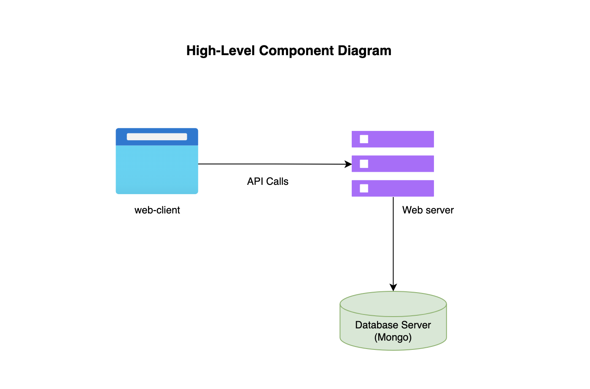
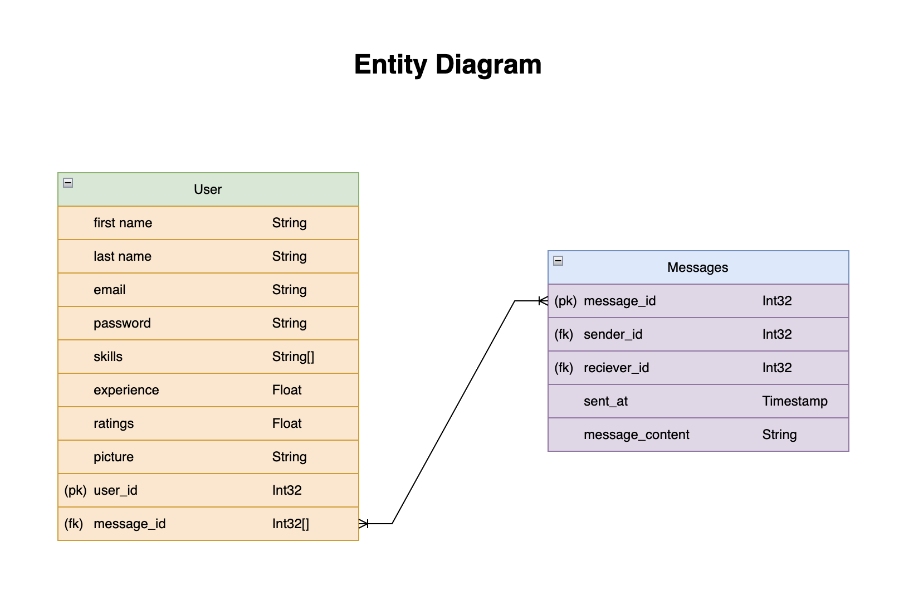
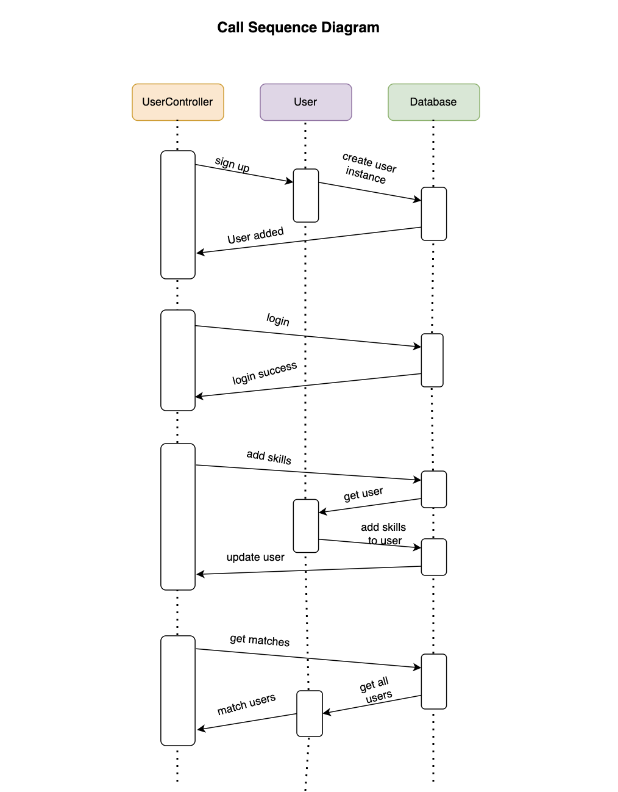

# SkillNet Architecture

## High-level component diagram:

The high-level component diagram of SkillNet web application displays the key parts such as the React UI, Express.js server, and MongoDB database, demonstrating how they work together including sending data back and forth and managing user interactions, offering a simple view of how the app functions.

3 main components:

- web client
- web server
- database server (MongoDB Atlas)

The web client, built React.js, serves as the user interface where interactions occur. It sends requests to the web server, implemented with Express.js, which handles these requests, processes them, and interacts with the database server. The database server, MongoDB Atlas, stores and manages application data such as user information, skills, and messages. The web server communicates with the database server to retrieve or modify data based on client requests, ensuring seamless functionality and data persistence for SkillNet users.

## Entity diagram

The entity diagram visually represents the structure of SkillNet database.

### User

This table contains information about users registered on SkillNet. It includes fields such as user_id (Primary Key), first name, last name, email, password, picture, experience, ratings. Additionally, it includes skills field, to associate users with the skills they possess. It also contains message_id (Foreign Key) to be connected with message table. Each user can send and recieve multiple messages.

### Messages

This table will store messages exchanged between users on SkillNet. It includes fields such as message_id (Primary Key), sender_id (Foreign Key), receiver_id (Foreign Key), message_content, sent_at. These fields will capture information about the sender and receiver of the message, the content of the message, and the timestamp when it was sent.

## Call Sequence Diagram

This diagram contains 3 objects:

- UserController
- User
- Datbase

In this Call Sequence Diagram:

- UserController Initiates sign up, User creates user instance and sends to the Database to be added and the Database adds the User and sends a success response back to the UserController.

- The UserController initiates login, User provides credentials, and Database verifies and returns login success.

- UserController adds skills to the database, the Database retrieves the user from User, User adds skills to the user in the database, and the Database sends updated users to the UserController.

- UserController requests matches from the database, the Database retrieves all users from User, and the User matches users before sending them to the UserController.

This Call Sequence Diagram actually illustrates the interactions between the UserController, User, and Database components in the SkillNet application.

