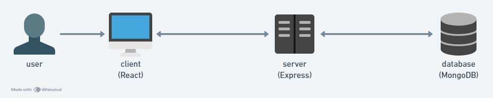

# Skillnet Architecture

## High-Level Component Diagram

Our application is built with the MERN stack, which consists of MongoDB, Express, Node, and React. When a user opens the application, they will directly interact with the client-side rendered by React. Any calls to the back-end will reach our server, which is running Node/Express. The server will grab data from the MongoDB database if the specific API call requests to do so.